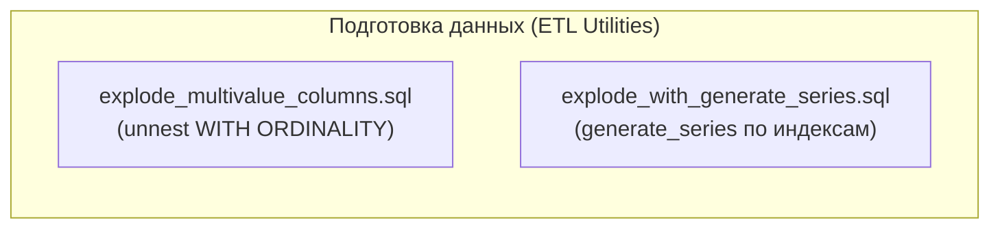
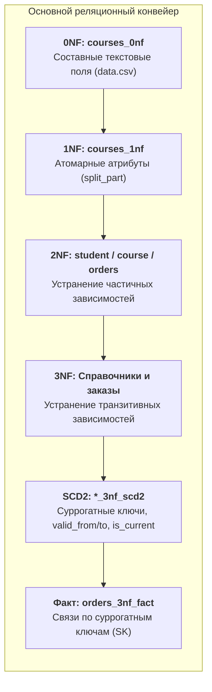
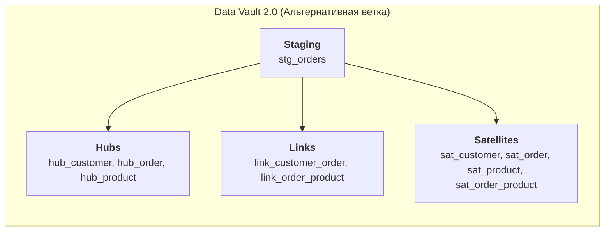

# Проект: Нормализация реляционной модели и SCD2 (0НФ → Звезда)

## Цель проекта
Учебный проект по проектированию моделей данных в СУБД PostgreSQL: от разбора неструктурированных сырых данных через нормализацию (0NF → 3NF) к аналитической витрине с историзацией SCD Type 2, дополненный SQL-инструментами предобработки и отдельной реализацией Data Vault 2.0.

## Основные задачи

1. **Последовательное преобразование данных через нормальные формы (0NF → 3NF):**
   - **0NF → 1NF:** Парсинг составных строк (`student_info`, `course_info`, `teacher_info`, `payment_info`) функцией `split_part()`, приведение атрибутов к атомарному виду и определение составного первичного ключа `(student_email, course_name, order_date)`.
   - **1NF → 2NF:** Устранение частичных функциональных зависимостей от составного PK, декомпозиция на сущности студентов (`student_2nf`), курсов (`course_2nf`) и связывающую таблицу заказов (`orders_2nf`).
   - **2NF → 3NF:** Устранение транзитивных зависимостей, вынос независимых справочников городов (`cities_3nf`), преподавателей (`teachers_3nf`), методов оплаты (`payment_methods_3nf`) и статусов оплаты (`payment_statuses_3nf`) со связыванием через внешние ключи (FK).

2. **Историзация сущностей и версионирование по методологии SCD Type 2:**
   * Добавление полей версионирования (`valid_from`, `valid_to`, `is_current`) и суррогатных первичных ключей (`*_sk`) в таблицы измерений:
     * `student_3nf` → `student_3nf_scd2`
     * `cities_3nf` → `cities_3nf_scd2`
     * `teachers_3nf` → `teachers_3nf_scd2`
     * `course_3nf` → `courses_3nf_scd2`
   * Обеспечение целостности актуальных данных с помощью частичных уникальных индексов (`WHERE is_current = true`).
   * Реализация процедур закрытия старых и открытия новых версий записей при изменении атрибутов (`update_*_3nf_scd2.sql`).

3. **Формирование аналитической витрины (Fact Table):**
   * Построение таблицы фактов `orders_3nf_fact`, фиксирующей бизнес-события заказов.
   * Связывание факта с измерениями через суррогатные ключи версий (`student_sk`, `course_sk`), что фиксирует точный исторический срез атрибутов на момент транзакции.

4. **Демонстрация смежных практик Data Engineering:**
   - **Data Vault 2.0:** Проектирование альтернативной независимой схемы хранилища с разделением на Staging (`stg_orders`), Hubs (`hub_*`), Links (`link_*`) и Satellites (`sat_*`) по концепции Insert-Only.
   - **ETL Utilities:** Реализация SQL-инструментов предобработки многострочных списков до этапа реляционного моделирования (`explode_multivalue_columns.sql` через `WITH ORDINALITY` и `explode_with_generate_series.sql`).

## Технологический стек

- **СУБД:** PostgreSQL 14+
- **Диалект:** PostgreSQL SQL (DDL, DML, Window Functions, Partial Indexes, String Parsing)
- **Методологии моделирования:**
  * Реляционная нормализация (1NF, 2NF, 3NF)
  * Slowly Changing Dimensions (SCD Type 2) с суррогатными ключами
  * Аналитическая витрина (Fact Table)
  * Data Vault 2.0 (Hubs, Links, Satellites, Insert-Only)
- **Документирование:** Mermaid, Architecture Decision Records (ADR), Operational Runbook

---

## Архитектура и структура решения

### Подготовка данных (ETL Utilities)


### Основной реляционный конвейер


### Data Vault 2.0 (Альтернативная ветка)


---

## Структура проекта
```
.
├── 0NF/
│   ├── 0NF.sql                           # DDL сырой таблицы courses_0nf
│   └── data.csv                          # Исходные данные с составными полями
├── 1NF/
│   └── 1NF.sql                           # Парсинг составных полей (split_part) в 1NF
├── 2NF/
│   └── 2NF.sql                           # Декомпозиция и устранение частичных зависимостей
├── 3NF/
│   └── 3NF.sql                           # Вынос справочников и связей в 3NF
├── 3NF_SCD2/
│   ├── DDL_3NF_SCD2.sql                  # DDL историзированных таблиц и таблицы фактов
│   ├── update_cities_3nf_scd2.sql        # Процедура версионирования городов
│   ├── update_courses_3nf_scd2.sql       # Процедура версионирования курсов
│   ├── update_student_3nf_scd2.sql       # Процедура версионирования студентов
│   └── update_teachers_3nf_scd2.sql      # Процедура версионирования преподавателей
├── DataVault/
│   └── schems.sql                        # Схема Hub, Link, Satellite (Data Vault 2.0)
├── etl_tools/
│   ├── README.md                         # Описание утилит трансформации строк
│   ├── explode_multivalue_columns.sql    # Разбор массивов через WITH ORDINALITY
│   └── explode_with_generate_series.sql  # Разбор массивов через generate_series
├── docs/
│   ├── architecture/
│   │   ├── model-flow.md                 # Поток данных и слои моделирования (Mermaid)
│   │   └── erd.md                        # Схема сущностей и связей целевой модели (Mermaid)
│   ├── decisions/
│   │   └── ADR-001-relational-model-and-scd2.md # Обоснование выбора SCD2 и SK
│   └── runbook/
│       └── README.md                     # Пошаговый порядок запуска SQL и верификация
├── Rules_of_Normalization.md             # Теоретическая справка по нормальным формам
└── README.md
```

---

## Слои моделирования данных

### 1. Основной конвейер: 0NF → 3NF → SCD2 → Fact

- **0NF (`0NF/`):** Исходная таблица `courses_0nf`, загружаемая из `data.csv`. Содержит составные строки (`email;name;phone;city|region`, `name|category|price`).
- **1NF (`1NF/`):** Таблица `courses_1nf`. Атрибуты приведены к атомарному виду с помощью строковых функций `split_part()`. Первичный ключ: `(student_email, course_name, order_date)`.
- **2NF (`2NF/`):** Устранение частичных функциональных зависимостей от составного первичного ключа. Модель декомпозирована на `student_2nf`, `course_2nf` и связывающую таблицу `orders_2nf`.
- **3NF (`3NF/`):** Устранение транзитивных зависимостей. Вынесены независимые справочники: `cities_3nf`, `teachers_3nf`, `payment_methods_3nf`, `payment_statuses_3nf`.
- **SCD Type 2 (`3NF_SCD2/`):** Историзация сущностей (`student_3nf_scd2`, `courses_3nf_scd2`, `teachers_3nf_scd2`, `cities_3nf_scd2`).
* Первичные суррогатные ключи (`*_sk`).
* Поля версионирования: `valid_from`, `valid_to` (по умолчанию `9999-12-31`), `is_current`.
* Гарантия уникальности активной версии через частичный уникальный индекс (`WHERE is_current = true`).
* Процедуры закрытия и создания версий реализованы в скриптах `update_*_3nf_scd2.sql`.


- **Аналитический факт (`orders_3nf_fact`):** Связывает бизнес-событие заказа с суррогатными ключами версий измерений на момент совершения транзакции.

### 2. Data Vault 2.0 (`DataVault/`)

Самостоятельный учебный блок реализации методологии Data Vault 2.0:

- **Hubs:** Реестр уникальных бизнес-ключей (`hub_customer`, `hub_order`, `hub_product`).
- **Links:** Неизменяемые связи бизнес-сущностей (`link_customer_order`, `link_order_product`).
- **Satellites:** Контекст и версионность атрибутов с применением хэш-диффов (`Hash Diff`) и стратегии Insert-Only (`sat_customer`, `sat_order`, `sat_product`, `sat_order_product`).

### 3. Предварительная трансформация (`etl_tools/`)

SQL-утилиты для предварительного разбора списков и многострочных значений:

* `explode_multivalue_columns.sql` — позиционный разбор через `unnest(...) WITH ORDINALITY`.
* `explode_with_generate_series.sql` — разбор через индексацию `generate_series`.

---

## Документация и эксплуатация

- **[Архитектурный поток данных (Model Flow)](docs/architecture/model-flow.md)** — взаимосвязь слоев трансформации и веток проекта.
- **[ER-диаграмма целевой витрины (ERD)](docs/architecture/erd.md)** — атрибуты, типы данных, первичные, внешние и суррогатные ключи.
- **[Архитектурное решение (ADR-001)](docs/decisions/ADR-001-relational-model-and-scd2.md)** — обоснование перехода к SCD Type 2, суррогатных ключей и частичных уникальных индексов.
- **[Руководство по запуску (Runbook)](docs/runbook/README.md)** — последовательность выполнения SQL-скриптов и проверочные аналитические запросы.
