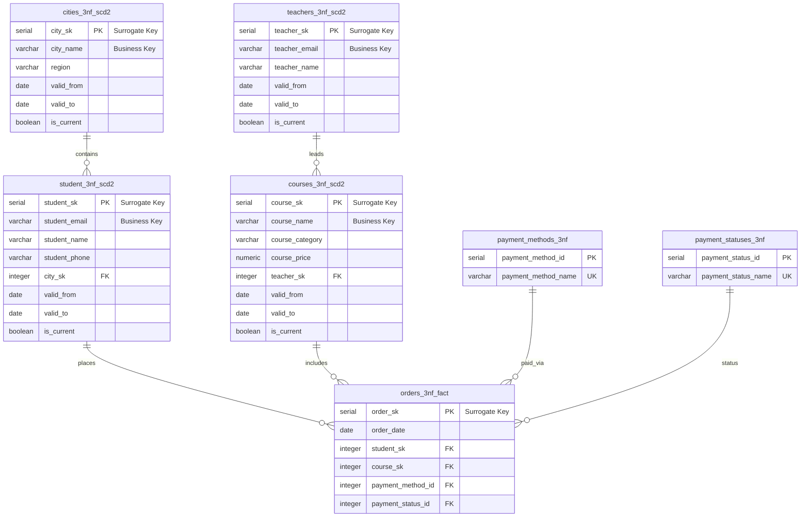

# ER-диаграмма реляционной модели (3NF + SCD2 + Fact)

Диаграмма отражает фактическую структуру и связи целевой модели данных, реализованной в скриптах `3NF/3NF.sql` и `3NF_SCD2/DDL_3NF_SCD2.sql`.



---

### Архитектурные детали реализации

1. **Разделение ключей (SK vs BK):**
* В таблицах измерений используются целочисленные суррогатные ключи (`*_sk`), формирующие первичный ключ версии записи.
* Бизнес-ключи (`student_email`, `course_name`, `teacher_email`, `city_name`) сохраняются для идентификации бизнес-объекта во времени.


2. **Контроль актуальности версий:**
* Каждая историзированная таблица использует атрибуты версионирования: `valid_from`, `valid_to` (значение `9999-12-31` для активной версии) и флаг `is_current`.
* Для предотвращения дублирования активных записей применяется частичный уникальный индекс:
```sql
CREATE UNIQUE INDEX ... ON <table> (business_key) WHERE is_current = true;

```

3. **Целостность связей факта:**
* Таблица `orders_3nf_fact` связывается непосредственно с версиями сущностей через внешние ключи на `student_sk` и `course_sk`, фиксируя срез данных на момент оформления заказа.

