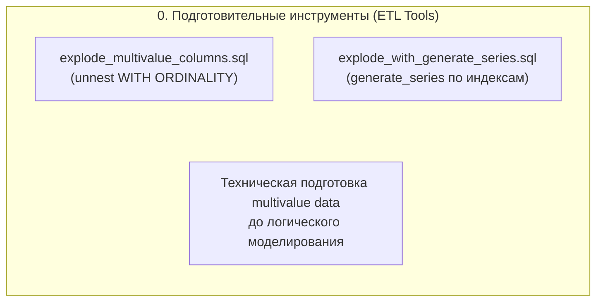
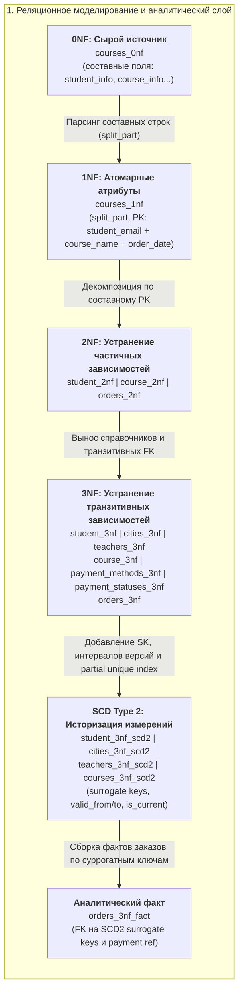
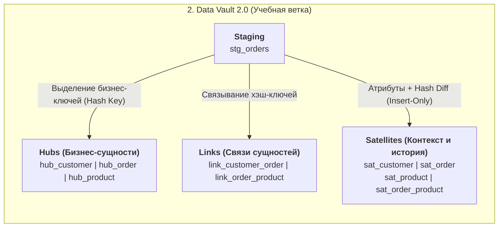

# Архитектурный поток данных (Model Flow)

Документ описывает логическую структуру проекта `DWH_Relational_Model` и взаимосвязь его компонентов.

Проект объединяет три инженерных блока:
1. **Подготовительный слой (ETL utilities):** инструменты преобразования многострочных значений в структурированные строки до этапа нормализации.
2. **Основной реляционный конвейер:** сквозное моделирование от ненормализованного источника (0NF) через 1NF–3NF к историзированной аналитической витрине (SCD Type 2 + Fact table).
3. **Data Vault 2.0:** отдельный учебный блок классического моделирования (Staging → Hubs → Links → Satellites).

---

### Особенности реализации

- **Связь ETL Tools и 0NF:** инструменты каталога `etl_tools` демонстрируют техники позиционного разбора списков и строк массивов в PostgreSQL. Они логически предваряют нормализацию, но не связаны с `0NF.sql` через автоматический пайплайн.
- **Изоляция Data Vault:** ветка `DataVault/` представляет собой самостоятельную альтернативную реализацию модели хранилища и не использует таблицы схемы `3NF_SCD2`.
